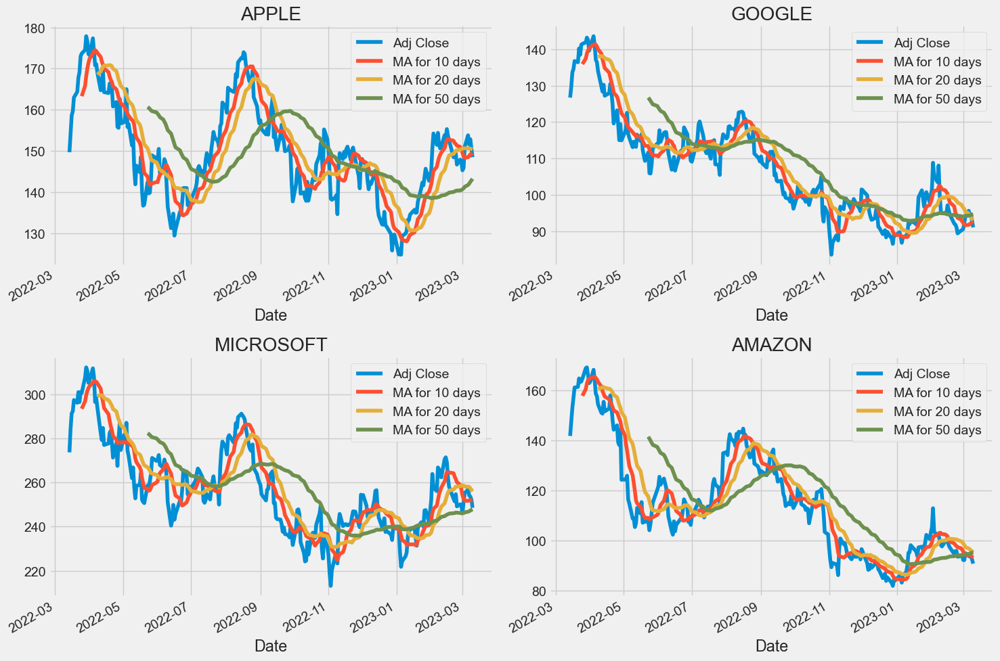
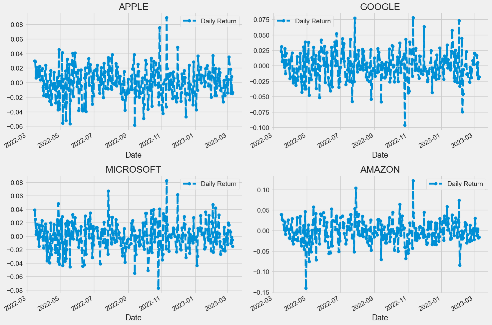
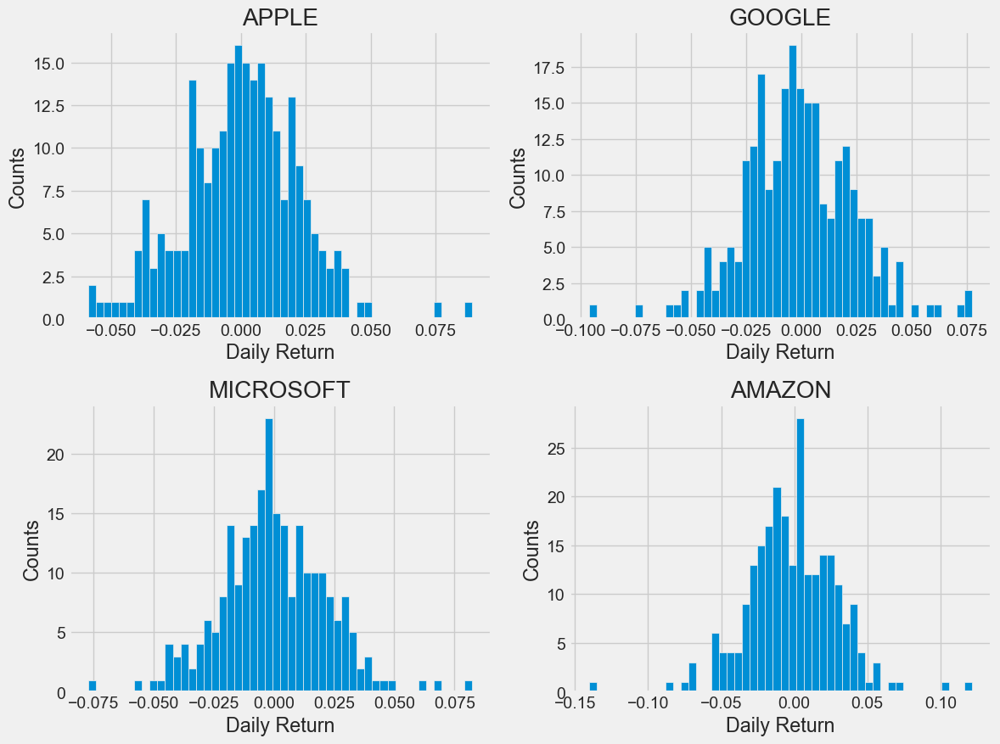

```python
# pandas 와 numpy 라이브러리 가져오기
import pandas as pd
import numpy as np

# matplotlib 과 seaborn 라이브러리 가져오기
import matplotlib.pyplot as plt
import seaborn as sns 
# pip install seaborn

# seaborn의 스타일 지정
sns.set_style('whitegrid')

# matplotlib의 스타일을 지정하기
plt.style.use("fivethirtyeight")

# 주피터 노트북에서 그래프 볼수 있도록 하기
%matplotlib inline

# yahoo에서 주식데이터 읽어오기
from pandas_datareader.data import DataReader
import yfinance as yf
from pandas_datareader import data as pdr

# yfinance 설정
yf.pdr_override()

# 시간 데이터를 다루기 위해 datetime 모듈 import
from datetime import datetime

# 분석할 기업 리스트를 정의하기
tech_list = ['AAPL', 'GOOG', 'MSFT', 'AMZN']

# 데이터를 가져올 기간 설정
end = datetime.now()
start = datetime(end.year - 1, end.month, end.day)

# 각 기업의 주식 데이터를 다운로드하고 변수에 저장
for stock in tech_list:
    globals()[stock] = yf.download(stock, start, end) # globals[key] 전역 네임스페이스 딕셔너리

# 각 기업에 대한 정보를 담고 있는 리스트를 정의
company_list = [AAPL, GOOG, MSFT, AMZN]
# 각 기업의 이름을 담고 있는 리스트를 정의
company_name = ["APPLE", "GOOGLE", "MICROSOFT", "AMAZON"]

# 각 기업의 주식 데이터에 company_name 컬럼 추가
for company, com_name in zip(company_list, company_name):
    company["company_name"] = com_name

# 모든 기업의 주식 데이터를 합쳐서 하나의 데이터 프레임으로 만든다.
df = pd.concat(company_list, axis=0)

# 데이터프레임 마지막 10개 행 출력
df.tail(10)
```

    [*********************100%***********************]  1 of 1 completed
    [*********************100%***********************]  1 of 1 completed
    [*********************100%***********************]  1 of 1 completed
    [*********************100%***********************]  1 of 1 completed
    


<div>
<style scoped>
    .dataframe tbody tr th:only-of-type {
        vertical-align: middle;
    }

    .dataframe tbody tr th {
        vertical-align: top;
    }

    .dataframe thead th {
        text-align: right;
    }
</style>
<table border="1" class="dataframe">
  <thead>
    <tr style="text-align: right;">
      <th></th>
      <th>Open</th>
      <th>High</th>
      <th>Low</th>
      <th>Close</th>
      <th>Adj Close</th>
      <th>Volume</th>
      <th>company_name</th>
    </tr>
    <tr>
      <th>Date</th>
      <th></th>
      <th></th>
      <th></th>
      <th></th>
      <th></th>
      <th></th>
      <th></th>
    </tr>
  </thead>
  <tbody>
    <tr>
      <th>2023-02-27</th>
      <td>94.279999</td>
      <td>94.779999</td>
      <td>93.139999</td>
      <td>93.760002</td>
      <td>93.760002</td>
      <td>47470300</td>
      <td>AMAZON</td>
    </tr>
    <tr>
      <th>2023-02-28</th>
      <td>93.139999</td>
      <td>94.690002</td>
      <td>92.919998</td>
      <td>94.230003</td>
      <td>94.230003</td>
      <td>43959300</td>
      <td>AMAZON</td>
    </tr>
    <tr>
      <th>2023-03-01</th>
      <td>93.870003</td>
      <td>94.680000</td>
      <td>91.589996</td>
      <td>92.169998</td>
      <td>92.169998</td>
      <td>52299500</td>
      <td>AMAZON</td>
    </tr>
    <tr>
      <th>2023-03-02</th>
      <td>91.410004</td>
      <td>92.230003</td>
      <td>90.389999</td>
      <td>92.129997</td>
      <td>92.129997</td>
      <td>55509400</td>
      <td>AMAZON</td>
    </tr>
    <tr>
      <th>2023-03-03</th>
      <td>92.739998</td>
      <td>94.940002</td>
      <td>92.660004</td>
      <td>94.900002</td>
      <td>94.900002</td>
      <td>55695300</td>
      <td>AMAZON</td>
    </tr>
    <tr>
      <th>2023-03-06</th>
      <td>95.190002</td>
      <td>96.550003</td>
      <td>93.739998</td>
      <td>93.750000</td>
      <td>93.750000</td>
      <td>52112400</td>
      <td>AMAZON</td>
    </tr>
    <tr>
      <th>2023-03-07</th>
      <td>94.059998</td>
      <td>95.089996</td>
      <td>92.779999</td>
      <td>93.550003</td>
      <td>93.550003</td>
      <td>49100700</td>
      <td>AMAZON</td>
    </tr>
    <tr>
      <th>2023-03-08</th>
      <td>93.599998</td>
      <td>94.169998</td>
      <td>92.180000</td>
      <td>93.919998</td>
      <td>93.919998</td>
      <td>44899100</td>
      <td>AMAZON</td>
    </tr>
    <tr>
      <th>2023-03-09</th>
      <td>93.680000</td>
      <td>96.209999</td>
      <td>92.180000</td>
      <td>92.250000</td>
      <td>92.250000</td>
      <td>56218700</td>
      <td>AMAZON</td>
    </tr>
    <tr>
      <th>2023-03-10</th>
      <td>92.669998</td>
      <td>93.570000</td>
      <td>90.250000</td>
      <td>90.730003</td>
      <td>90.730003</td>
      <td>69747500</td>
      <td>AMAZON</td>
    </tr>
  </tbody>
</table>
</div>


```python
# AAPL 변수에 저장된 애플 주식 데이터 요약 통계 정보 출력
AAPL.describe()
```


<div>
<style scoped>
    .dataframe tbody tr th:only-of-type {
        vertical-align: middle;
    }

    .dataframe tbody tr th {
        vertical-align: top;
    }

    .dataframe thead th {
        text-align: right;
    }
</style>
<table border="1" class="dataframe">
  <thead>
    <tr style="text-align: right;">
      <th></th>
      <th>Open</th>
      <th>High</th>
      <th>Low</th>
      <th>Close</th>
      <th>Adj Close</th>
      <th>Volume</th>
    </tr>
  </thead>
  <tbody>
    <tr>
      <th>count</th>
      <td>250.000000</td>
      <td>250.000000</td>
      <td>250.000000</td>
      <td>250.000000</td>
      <td>250.000000</td>
      <td>2.500000e+02</td>
    </tr>
    <tr>
      <th>mean</th>
      <td>150.094720</td>
      <td>152.195120</td>
      <td>148.191440</td>
      <td>150.284480</td>
      <td>149.784552</td>
      <td>8.290853e+07</td>
    </tr>
    <tr>
      <th>std</th>
      <td>11.918376</td>
      <td>11.854458</td>
      <td>11.972534</td>
      <td>11.968085</td>
      <td>11.802899</td>
      <td>2.376815e+07</td>
    </tr>
    <tr>
      <th>min</th>
      <td>126.010002</td>
      <td>127.769997</td>
      <td>124.169998</td>
      <td>125.019997</td>
      <td>124.829399</td>
      <td>3.519590e+07</td>
    </tr>
    <tr>
      <th>25%</th>
      <td>142.099998</td>
      <td>143.722496</td>
      <td>139.924995</td>
      <td>142.457497</td>
      <td>141.965420</td>
      <td>6.781350e+07</td>
    </tr>
    <tr>
      <th>50%</th>
      <td>148.884995</td>
      <td>150.889999</td>
      <td>147.200005</td>
      <td>149.295006</td>
      <td>148.892677</td>
      <td>7.775785e+07</td>
    </tr>
    <tr>
      <th>75%</th>
      <td>156.912498</td>
      <td>159.265003</td>
      <td>154.447506</td>
      <td>156.874996</td>
      <td>156.319740</td>
      <td>9.150922e+07</td>
    </tr>
    <tr>
      <th>max</th>
      <td>178.550003</td>
      <td>179.610001</td>
      <td>176.699997</td>
      <td>178.960007</td>
      <td>177.882462</td>
      <td>1.826020e+08</td>
    </tr>
  </tbody>
</table>
</div>


```python
# AAPL 변수에 저장된 애플 주식 데이터의 일반 정보 출력
AAPL.info()
```

    <class 'pandas.core.frame.DataFrame'>
    DatetimeIndex: 250 entries, 2022-03-14 to 2023-03-10
    Data columns (total 7 columns):
     #   Column        Non-Null Count  Dtype  
    ---  ------        --------------  -----  
     0   Open          250 non-null    float64
     1   High          250 non-null    float64
     2   Low           250 non-null    float64
     3   Close         250 non-null    float64
     4   Adj Close     250 non-null    float64
     5   Volume        250 non-null    int64  
     6   company_name  250 non-null    object 
    dtypes: float64(5), int64(1), object(1)
    memory usage: 15.6+ KB
    


```python
# 그래프의 크기를 지정하기
plt.figure(figsize=(15, 10))

# 그래프 간의 간격 조절
plt.subplots_adjust(top=1.25, bottom=1.2)

# 모든 기업에 대해 그래프 그리기
for i, company in enumerate(company_list, 1):
    # 2X2의 그래프에서 i번째 위치에 그래프를 그립니다.
    plt.subplot(2, 2, i)

    # 기업의 종가 데이터를 그래프로 나타내기
    company['Adj Close'].plot()
    
    # y축 라벨을 설정하기
    plt.ylabel('Adj Close')
    
    # x축 라벨은 생략하기
    plt.xlabel(None)
    
    # 그래프 제목을 설정하기
    plt.title(f"Closing Price of {tech_list[i - 1]}")
    

# 그래프들이 서로 겹치지 않도록 자동으로 간격 조절하기
plt.tight_layout()
```


      File "C:\Users\ITSC\AppData\Local\Temp\ipykernel_2192\602665504.py", line 10
        plt.subplot(nrows=2, ncols=2, i)
                                       ^
    SyntaxError: positional argument follows keyword argument
    


```python
# 이동평균을 계산할 날짜 리스트를 정의
ma_day = [10, 20, 50]

# 모든 기업에 대해 이동평균을 계산하고, 이동편균 값을 컬럼으로 추가하기
for ma in ma_day:
    for company in company_list:
        column_name = f"MA for {ma} days"
        company[column_name] = company['Adj Close'].rolling(ma).mean()
        
# 그래프를 그리기 위해 그래프 크기 설정하기
fig, axes = plt.subplots(nrows=2, ncols=2)
fig.set_figheight(10)
fig.set_figwidth(15)

# APPLE 주식에 대한 그래프 그리기
AAPL[['Adj Close', 'MA for 10 days', 'MA for 20 days', 'MA for 50 days']].plot(ax=axes[0,0])
axes[0,0].set_title('APPLE')

# GOOGLE 주식에 대한 그래프 그리기
GOOG[['Adj Close', 'MA for 10 days', 'MA for 20 days', 'MA for 50 days']].plot(ax=axes[0,1])
axes[0,1].set_title('GOOGLE')

# MICROSOFT 주식에 대한 그래프 그리기
MSFT[['Adj Close', 'MA for 10 days', 'MA for 20 days', 'MA for 50 days']].plot(ax=axes[1,0])
axes[1,0].set_title('MICROSOFT')

# AMAZON 주식에 대한 그래프 그리기
AMZN[['Adj Close', 'MA for 10 days', 'MA for 20 days', 'MA for 50 days']].plot(ax=axes[1,1])
axes[1,1].set_title('AMAZON')


# 서로 겹치지 않게 그래프 조정
fig.tight_layout()
```


    

    


```python
# 모든 기업에 대해 일별 주가 변동율을 계산하고, Daily Return 컬럼으로 추가하기
for company in company_list:
    company['Daily Return'] = company['Adj Close'].pct_change()
    
# 그래프를 그리기 위해 그래프크기 설정
fig, axes = plt.subplots(nrows=2, ncols=2)
fig.set_figheight(10)
fig.set_figwidth(15)

# APPLE 주식의 일별 주가 변동율
AAPL['Daily Return'].plot(ax=axes[0,0], legend=True, linestyle='--', marker='o')
axes[0,0].set_title('APPLE')

# GOOGLE 주식의 일별 주가 변동율
GOOG['Daily Return'].plot(ax=axes[0,1], legend=True, linestyle='--', marker='o')
axes[0,1].set_title('GOOGLE')

# MICROSOFT 주식의 일별 주가 변동율
MSFT['Daily Return'].plot(ax=axes[1,0], legend=True, linestyle='--', marker='o')
axes[1,0].set_title('MICROSOFT')

# AMAZON 주식의 일별 주가 변동율
AMZN['Daily Return'].plot(ax=axes[1,1], legend=True, linestyle='--', marker='o')
axes[1,1].set_title('AMAZON')

# 서로 겹치지 않게 그래프 조정
fig.tight_layout()
```


    

    


```python
# 그래프의 크기를 지정하기
plt.figure(figsize=(12,9))

# 모든 기업에 대해 일별 주가 변동율의 히스토그램 그리기
for i, company in enumerate(company_list, 1):
    plt.subplot(2, 2, i)
    company['Daily Return'].hist(bins=50)
    plt.xlabel('Daily Return')
    plt.ylabel('Counts')
    plt.title(f'{company_name[i - 1]}')

# 그래프들이 서로 겹치지 않도록 간격 조절
plt.tight_layout()    
```


    

    


```python

```
